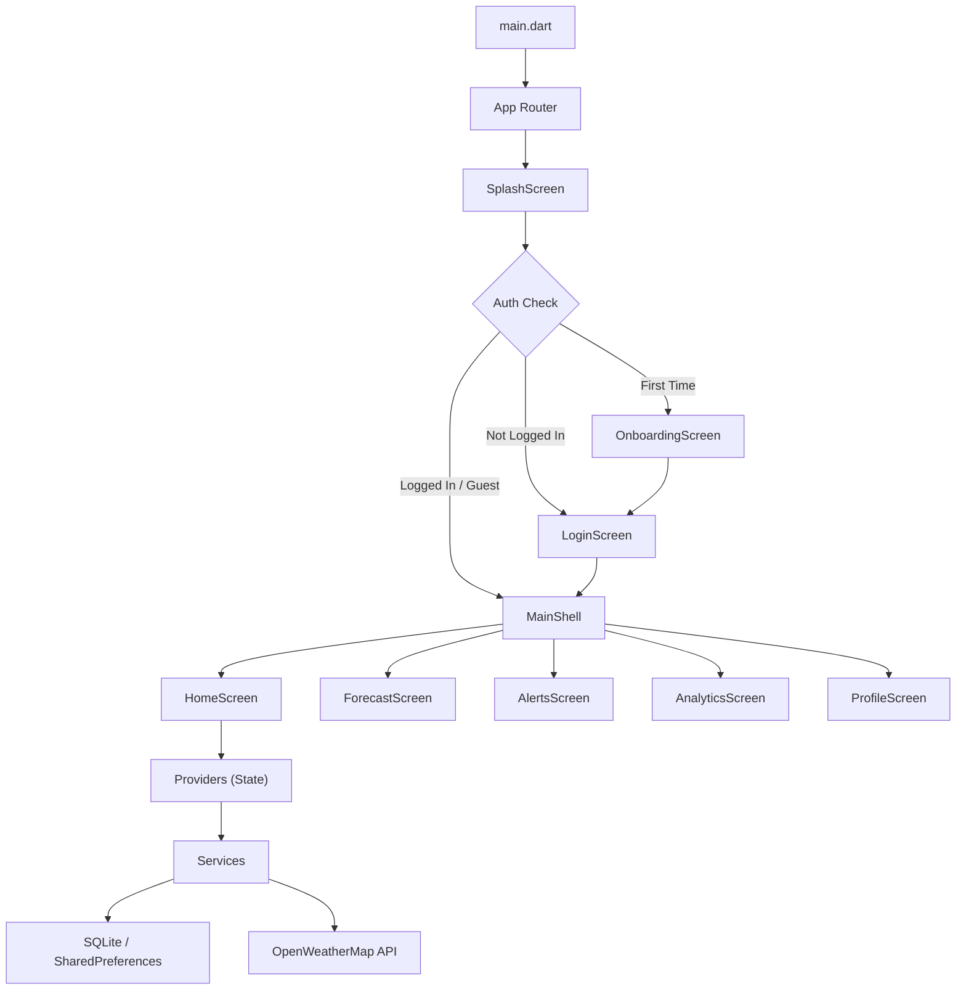

# Smart Weather Monitor Pro

[](https://flutter.dev)
[](https://m3.material.io)
[](https://pub.dev/packages/provider)
[](https://pub.dev/packages/sqflite)

> **Predict. Analyze. Stay Ahead.**

An intelligent, professional weather analytics and forecasting dashboard built with **Flutter (Material 3)**. Featuring advanced glassmorphic styling, multi-city tracking, local user authentication, offline caching, real-time alert triggers, and high-fidelity charting analytics.

---

## 🎨 Premium Visual UI/UX

Inspired by commercial weather products like AccuWeather and Google Weather:
- **Glassmorphism Design**: High-end transparent layouts with dynamic borders and drop-shadows.
- **Weather-condition Adaptive Backgrounds**: Seamlessly changes primary gradient schemes depending on the current weather (Clear, Clouds, Rain, Snow, Storm, Mist).
- **Subtle Micro-Animations**: Floating cloud condition graphics and staggered entry slide animations on metrics cards.
- **Dark and Light Theme support**: Seamless transitions across modes, fully persistent.

---

## 🚀 Key Features

1. **Real-time Weather Telemetry**: Direct integration with the OpenWeatherMap API, retrieving temperature, feels like, humidity, pressure, wind speed, visibility, and weather condition.
2. **Air Quality Index & UV Indicators**: Estimated status meters to warning threshold limits.
3. **5-Day / 3-Hour Forecast Analysis**: Tabbed screens exposing hourly horizontal timelines and aggregated daily forecast cards.
4. **Intelligent Alert System**: Generates custom severe weather notifications (Heat Wave, Extreme Cold, Storm, Heavy Rain, High Wind, Poor AQI) with color-coded severity levels.
5. **Analytics Dashboard**: Dynamic charts visualizing temperature trends (line chart) and humidity levels (bar chart) using `fl_chart`.
6. **Local User Authentication & Profiles**: Register, login, or guest modes fully backed by a local SQLite engine.
7. **Offline Cache Strategy**: TTL-validated caching (30 minutes) using SQLite, letting users inspect cached details when network connectivity is lost.
8. **PDF Report Export**: Professional formatting utilizing `pdf` and `printing` packages to easily share or print current conditions and forecasts.

---

## 📐 Architecture & Flow



---

## 📁 Project Directory Structure

```text
lib/
├── core/
│   ├── app_constants.dart      # Global API, key configuration, defaults
│   ├── app_exceptions.dart     # Custom exception mappings
│   └── app_router.dart         # Named routes routing table
├── database/
│   ├── database_helper.dart    # SQLite CRUD queries and connection
│   └── tables.dart             # Database SQL creation tables
├── models/
│   ├── weather_model.dart      # Weather data parsing
│   ├── forecast_model.dart     # Forecast timeline models
│   ├── user_model.dart         # User auth profile model
│   ├── city_model.dart         # Searched city favorite model
│   ├── weather_alert_model.dart# Weather alert threshold model
│   └── weather_history_model.dart# Analytics history log model
├── providers/
│   ├── weather_provider.dart   # Weather logic state notifier
│   ├── forecast_provider.dart  # Forecast logic state notifier
│   ├── theme_provider.dart     # Dark/light persistence state notifier
│   ├── auth_provider.dart      # User session notifier
│   ├── city_provider.dart      # Favorites and search history notifier
│   └── alert_provider.dart     # Alarm and warning registry notifier
├── screens/
│   ├── splash_screen.dart      # Fade-in logo entrance screen
│   ├── onboarding_screen.dart  # 3-page guide guides
│   ├── main_shell.dart         # Tab navigation shell controller
│   ├── auth/                   # Register, login, forgot password screens
│   ├── home/                   # Weather dashboard and search page
│   ├── forecast/               # Timeline and aggregate forecast lists
│   ├── alerts/                 # Warning logs
│   ├── analytics/              # fl_chart analytics dashboard
│   └── profile/                # Settings, PDF exports, logout
├── services/
│   ├── weather_service.dart    # OpenWeatherMap current API calls
│   ├── forecast_service.dart   # OpenWeatherMap 5-day forecast API calls
│   ├── location_service.dart   # Geocoding direct query lookup
│   ├── auth_service.dart       # Local SQLite user queries
│   ├── cache_service.dart      # SQLite offline backup cache
│   ├── alert_service.dart      # Telemetry warning threshold processor
│   ├── analytics_service.dart  # SQLite historical tracking logger
│   └── pdf_service.dart        # PDF sharing report generator
├── themes/
│   ├── app_colors.dart         # Weather condition color schemes
│   └── app_theme.dart          # MaterialApp Material 3 dark/light templates
└── widgets/                    # Reusable visual components (charts, gauges, cards)
```

---

## ☕ Java OOP Architecture Component

Located in `/java_oop/`, this module contains the decoupled Java Object-Oriented design representation of the weather business logic:
- Exposes **Encapsulation** (`User.java`), **Inheritance** (`ForecastData.java` -> `WeatherData.java`), **Abstraction** (`IWeatherService.java`), and **Polymorphism** (`WeatherService.java`).
- Implements design patterns: **Singleton**, **Observer**, **Strategy**, and **Factory**.
- Exposes a detailed class relationship guide and Mermaid diagram in [java_oop/README.md](java_oop/README.md).

---

## 🛠️ Setup & Running

### Prerequisites
- Flutter SDK (Latest Stable version)
- Dart SDK
- Android Studio / VS Code with Flutter extension
- An active Internet connection for API data fetches

### Installation

1. **Clone the repository**:
   ```bash
   git clone <repository_url>
   cd "weather monitoring"
   ```

2. **Retrieve package dependencies**:
   ```bash
   flutter pub get
   ```

3. **Configure API Key (Optional)**:
   The application uses a default API key declared in [lib/core/app_constants.dart](lib/core/app_constants.dart). You can replace the value of `kApiKey` with your own key from [OpenWeatherMap](https://openweathermap.org/api) for production rate limits.

4. **Verify Analysis and Code Quality**:
   ```bash
   flutter analyze
   ```

5. **Run the application**:
   ```bash
   flutter run
   ```

---

## 📄 License
This project is licensed under the MIT License.
