# Java OOP Design Documentation

This directory contains the Java OOP Architecture designs for the **Smart Weather Monitor Pro** platform, demonstrating clean coding principles, the four pillars of Object-Oriented Programming, and popular software design patterns.

---

## 🏛️ The Four Pillars of OOP

Our architecture showcases the core OOP principles through dedicated classes:

### 1. Encapsulation (`User.java`)
- **What it does**: Restricts direct access to an object's fields to protect its internal state.
- **Implementation**:
  - All properties (like `name`, `email`, `passwordHash`) are marked `private`.
  - Public Getter and Setter methods control read and write operations.
  - Setters include validation logic (e.g., verifying that email contains `@`, name is at least 2 characters).
  - Constructor overloading allows creating standard users or guest users with varying initial states.

### 2. Inheritance (`ForecastData.java` extending `WeatherData.java`)
- **What it does**: Allows a child class to inherit fields and behaviors from a parent class to promote code reusability.
- **Implementation**:
  - `WeatherData` serves as the parent class, housing standard metrics like temperature, wind speed, and pressure.
  - `ForecastData` extends `WeatherData`, inheriting all parent fields.
  - Adds specific properties relevant to forecast telemetry (e.g., `forecastDate` and `precipitationProbability`).
  - Uses `super(...)` to invoke the parent constructor, cleanly linking class hierarchies.

### 3. Abstraction (`IWeatherService.java`)
- **What it does**: Hides complex background implementation details and exposes only a clean, simple contract to clients.
- **Implementation**:
  - Defines the service contracts through interfaces with empty declarations.
  - Standardizes the API signature for fetching weather and forecast data without locking clients into specific HTTP library implementations.

### 4. Polymorphism (`WeatherService.java` implementing `IWeatherService`)
- **What it does**: Allows objects of different classes to be treated as instances of a common superclass or interface, resolving behaviors dynamically at runtime.
- **Implementation**:
  - `WeatherService` implements `IWeatherService` and overrides its abstract methods using the `@Override` annotation.
  - Allows the application to run queries on the abstract `IWeatherService` contract while resolving call logic to the concrete class dynamically at runtime.

---

## 🎨 Software Design Patterns

The architecture incorporates four foundational software design patterns:

### 1. Singleton Pattern (`WeatherManager.java`)
- Ensures that a service manager has only one active instance in the application lifecycle.
- Implements a private constructor to prevent external instantiation.
- Exposes a static synchronized `getInstance()` method for thread-safe, lazy-initialized retrieval.

### 2. Observer Pattern (`AlertManager.java`)
- Standardizes one-to-many dependency notifications.
- Maintains a registry of active weather observers (`IWeatherObserver`).
- Broadcasts real-time events (like `Heat Wave Alert` or `Storm Alert`) to all subscribers automatically when weather telemetry thresholds are crossed.

### 3. Strategy Pattern (`AnalyticsManager.java`)
- Decouples computation algorithms from client consumers, allowing them to be swapped dynamically at runtime.
- Defines an `IAnalyticsStrategy` interface.
- Exposes concrete strategies (like `MeanTemperatureStrategy` and `MaxTemperatureStrategy`) that can be dynamically registered in `AnalyticsManager` to run statistics on weather historical records.

### 4. Factory Pattern (`LocationManager.java`)
- Decouples instantiation logic from usage.
- Uses a static method `getProvider(String type)` to dynamically create location providers (`GpsLocationProvider` or `IpGeoProvider`) based on inputs, abstracting instantiation details away from client caller classes.

---

## 📊 Class Relationships (UML Diagram)

```mermaid
classDiagram
    class User {
        -int id
        -String name
        -String email
        -String passwordHash
        -String profilePicturePath
        -Date createdAt
        +User()
        +User(String name)
        +User(int id, String name, String email, ...)
        +getId() int
        +setId(int id)
        +getName() String
        +setName(String name)
    }

    class WeatherData {
        -String cityName
        -String country
        -double temperature
        -double feelsLike
        -int humidity
        -double windSpeed
        -int pressure
        -int visibility
        -String weatherCondition
        -String weatherDescription
        -String iconCode
        +WeatherData(...)
        +getTemperature() double
        +setTemperature(double temp)
    }

    class ForecastData {
        -Date forecastDate
        -double precipitationProbability
        +ForecastData(...)
        +getForecastDate() Date
        +setForecastDate(Date date)
    }
    WeatherData <|-- ForecastData

    class IWeatherService {
        <<interface>>
        +fetchCurrentWeather(String city) WeatherData
        +fetchForecast(String city) List~ForecastData~
    }

    class WeatherService {
        -String apiKey
        +WeatherService(String apiKey)
        +fetchCurrentWeather(String city) WeatherData
        +fetchForecast(String city) List~ForecastData~
    }
    IWeatherService <|.. WeatherService

    class WeatherManager {
        -static WeatherManager instance
        -IWeatherService activeService
        -WeatherManager()
        +static getInstance() WeatherManager
        +getActiveService() IWeatherService
        +registerService(IWeatherService service)
    }
    WeatherManager --> IWeatherService

    class IAlertManager {
        <<interface>>
        +processWeatherAlerts(WeatherData weather)
        +setThresholds(double tempMax, double windMax)
    }

    class AlertManager {
        -List~IWeatherObserver~ observers
        -double maxTempThreshold
        -double maxWindThreshold
        +addObserver(IWeatherObserver observer)
        +removeObserver(IWeatherObserver observer)
        +setThresholds(double tempMax, double windMax)
        +processWeatherAlerts(WeatherData weather)
    }
    IAlertManager <|.. AlertManager
    AlertManager --> IWeatherObserver

    class IWeatherObserver {
        <<interface>>
        +onWeatherAlert(String type, String message)
    }

    class IAnalyticsStrategy {
        <<interface>>
        +calculateMetric(List~WeatherData~ history) double
    }
    class MeanTemperatureStrategy {
        +calculateMetric(List~WeatherData~ history) double
    }
    class MaxTemperatureStrategy {
        +calculateMetric(List~WeatherData~ history) double
    }
    IAnalyticsStrategy <|.. MeanTemperatureStrategy
    IAnalyticsStrategy <|.. MaxTemperatureStrategy

    class AnalyticsManager {
        -IAnalyticsStrategy strategy
        +setStrategy(IAnalyticsStrategy strategy)
        +compute(List~WeatherData~ history) double
    }
    AnalyticsManager --> IAnalyticsStrategy

    class ILocationProvider {
        <<interface>>
        +getProviderName() String
        +getCoords(String city) double[]
    }
    class GpsLocationProvider {
        +getProviderName() String
        +getCoords(String city) double[]
    }
    class IpGeoProvider {
        +getProviderName() String
        +getCoords(String city) double[]
    }
    ILocationProvider <|.. GpsLocationProvider
    ILocationProvider <|.. IpGeoProvider

    class LocationManager {
        +static getProvider(String type) ILocationProvider
    }
    LocationManager --> ILocationProvider
```

